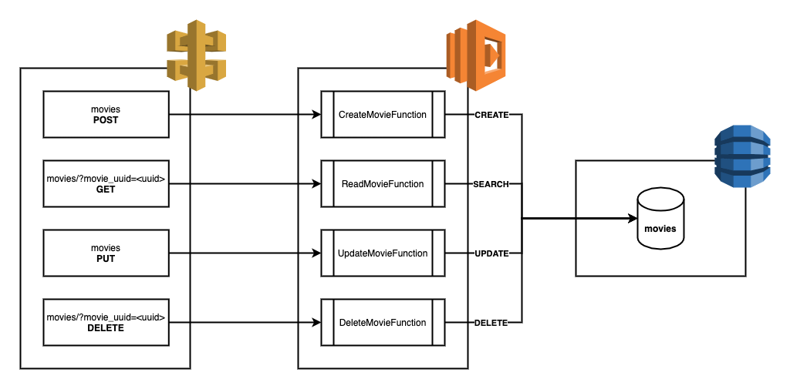

# AWS lambda CRUD proxy

This repository has been written in Python and represents a fully functional Serverless CRUD API in front of an AWS DynamoDB table that manages the "movies" domain. An API Gateway distributes the requests to the AWS lambda functions based on their HTTP mehtods.

We have the following operations: 

* Create a movie:
    * Http Verb: POST
    * URI: /movies
    * Body JSON:
        * year: <integer>
        * title: <string>
        * rank: <float>

```bash
    curl --request POST \
      --url '<API_URL>/movies' \
      --data '{\n	"year": <YEAR>,\n	"title": <TITLE>,\n	"rank":<RANK>\n}'
```

* Read a movie:
    * Http Verb: GET
    * URI: /movies
    * Get parameters:
        * movie_uuid: <uuid>

```bash
    curl --request GET \
      --url '<API_URL>/movies?movie_uuid=<MOVIE_UUID>' \
```

* Update a movie:
    * Http Verb: PUT
    * URI: /movies
    * Body JSON:
        * movie_uuid: <uuid>
        * year: <integer>
        * title: <string>
        * rank: <float>

```bash
    curl --request PUT \
      --url '<API_URL>/movies' \
      --header 'content-type: application/json' \
      --data '{\n	"movie_uuid": <MOVIE_UUID>,\n	"year": <YEAR>,\n	"title": <TITLE>,\n	"rank": <RANK>\n}'
```

* Delete a movie:
    * Http Verb: DELETE
    * URI: /movies
    * Get parameters:
        * movie_uuid: <uuid>

```bash
    curl --request DELETE \
      --url '<API_URL>/movies?movie_uuid=<MOVIE_UUID>' \
```

Also, the application architecture is defined in the template.yaml, a Serverless Application Model (SAM) template.




## Overview of the files

```text
.
├── README.md                          <-- This README file
├── src                                <-- Directory for all AWS Lambda functions (handlers)
│   ├── create_movie.py                <-- Lambda CreateMovie function code
│   ├── read_movie.py                  <-- Lambda ReadMovie function code
│   ├── update_movie.py                <-- Lambda UpdateMovie function code
│   └── delete_movie.py                <-- Lambda DeleteMovie function code
├── apigw-lambda.png                   <-- Flow chart with the high level architecture
└── template.yaml                      <-- SAM infrastructure-as-code template
```


## Pre requirements

* AWS account.
* **AWS CLI**, have a look on https://docs.aws.amazon.com/cli/latest/userguide/cli-chap-install.html.


## Tecnologies used
* **AWS Lambda** for running code without provisioning servers.
* **AWS API Gateway** for serverless API creation and management.
* **AWS IAM** for creating roles for the lambdas functions.
* **AWS DynamoDB** for a managed NoSQL database.


## Deploying

In order to deploy, we will need to run the following commands:
* This command is going to prepare the package and upload into S3 bucket.
```bash
aws cloudformation package --template-file template.yaml --s3-bucket <BUCKET_NAME> --output-template-file packaged-template.yaml
```
* This command will deploy all the stack.
```bash
aws --region eu-west-1 cloudformation deploy --template-file packaged-template.yaml --stack-name <STACK_NAME> --capabilities CAPABILITY_IAM
```
